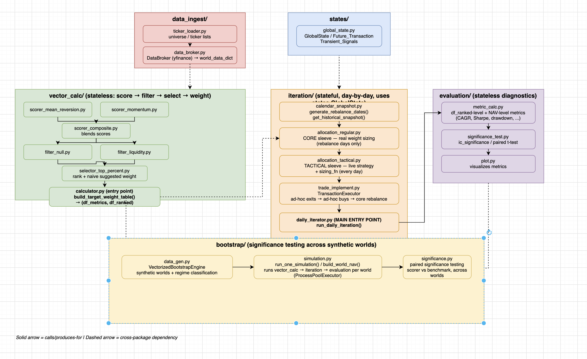

# Architecture

> Single-source backtest framework. **Validation, not selection** — verify whether a strategy works, not which strategy to pick.

## Signal Pipeline

The backtest runs as a 5-layer signal pipeline:

```
DataBroker → Selector/Scorer → Filter(s) → BudgetAllocator → TransactionExecutor → GlobalState
 (yfinance)     (per-strategy)    (optional)    (top-N, sizing)   (fills, fees, delay)   (state store)
```



## Package Structure

Packages are organized in pipeline order. Each one builds on the ones above it.

### `states/` — stateful core
`GlobalState` (and `Future_Transaction` / `Transient_Signals`) holds cash, positions (split into CORE + TACTICAL sleeves), and the NAV history ledger. Single source of truth — every other package mutates it only through `commit_executed_trade()`.

### `data_ingest/` — market data
`DataBroker` (yfinance wrapper) pulls historical OHLCV and returns `{"price": df, "volume": df}` matrices. `ticker_loader.py` provides static universe/ticker lists.

### `vector_calc/` — stateless precomputation
Score → filter → select → suggested weight, **computed once up front, no state dependency**.
- `scorer_*.py` — momentum, mean reversion, composite
- `filter_*.py` — eligibility masks (null, liquidity)
- `selector_top_percent.py` — ranks by score, cuts to top-percent, assigns a naive weight
- `calculator.py` — entry point (`build_target_weight_table`)

### `iteration/` — day-by-day execution
The stateful loop:
1. `calendar_snapshot.py` — rebalance dates + leak-safe snapshot
2. `allocation_regular.py` — CORE sleeve (real weight sizing lives here)
3. `allocation_tactical.py` — TACTICAL sleeve (live ad-hoc signals + position sizing)
4. `trade_implement.py` — `TransactionExecutor`: fills with fees + `trade_delay`
5. `daily_iterator.py` — orchestrator (`run_daily_iteration`)

### `evaluation/` — diagnostics
Stateless readers of the above. `metric_calc.py` computes per-name (IC, contribution, turnover) and NAV-level (CAGR, Sharpe, drawdown) metrics. `significance_test.py` tests real-vs-noise. `plot.py` visualizes.

### `bootstrap/` — significance across synthetic worlds
Generates synthetic price/volume worlds via `VectorizedBootstrapEngine` (with bull/bear/choppy regime classification), runs the full pipeline on each world, then paired-tests for cross-world significance.

## Design Principles

### 1. Stateless precomputation + thin stateful loop
`vector_calc` builds the entire score/filter/selection table once, before the loop starts. `iteration` only reads it. Daily runtime cost is small regardless of universe size, and look-ahead-bias is structurally impossible — the loop never re-scores on later data.

### 2. CORE vs TACTICAL — precomputable vs path-dependent
Two structurally different sleeves, not just two code paths:

| | CORE (regular) | TACTICAL (ad-hoc) |
|---|---|---|
| Decided | Once, up front, in `vector_calc` | Live, every day, in the loop |
| Needs live state? | No | Yes (checks current positions) |
| Frequency | Rebalance dates only | Every day |
| Output | `target_weight` table | One BUY/EXIT signal or nothing |
| Sizing | Precomputed (naive), unless overridden | Always live (`sizing_fn`) |

### 3. Weight/position sizing lives in `iteration/`, never in `vector_calc/`
`vector_calc` is stateless and precomputed. Real sizing needs live cash/positions (safety reserves, position caps, drift thresholds) — `vector_calc` structurally cannot see these. The naive precomputed weight in `vector_calc/selector_top_percent.py` is a fast baseline; real sizing overrides it in `iteration/allocation_*.py`.

### 4. Pluggable scorers / filters / selectors
Every stage in `vector_calc/` has an ABC base class. To add a new strategy, drop in a `scorer_xxx.py` / `filter_xxx.py` / `selector_xxx.py` with the matching signature — nothing else in the package needs to change.

## Notebooks

End-to-end demo notebooks live in `notebooks/`.
(See `dev_notebooks/` on the `main` branch for the development / exploration notebooks used to build them.)
